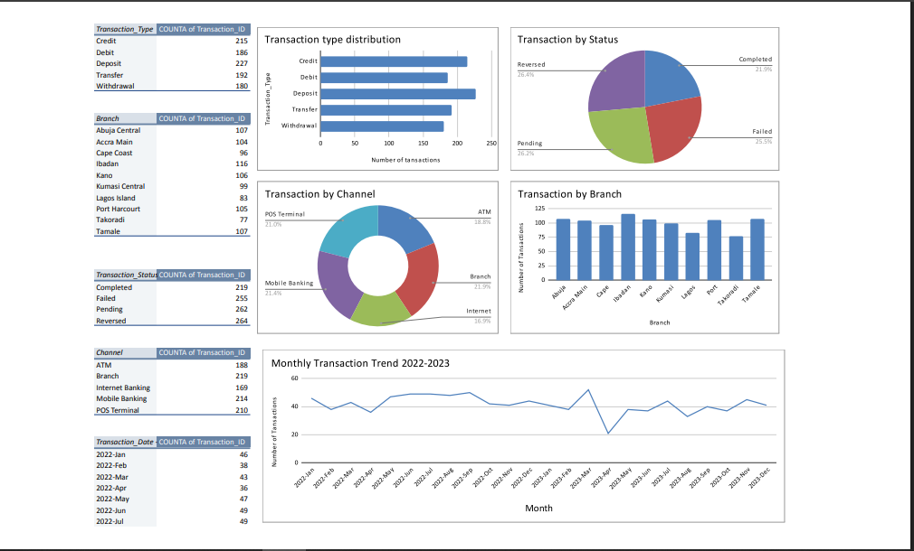

# Bank-Transaction-Data-Cleaning-and-EDA.
An excel project on a West African bank transaction dataset. Data cleaning with visual error auditing (color coding), handling of nulls, mixed date formats, and inconsistent entries with exploratory analysis using pivot tables and charts.

